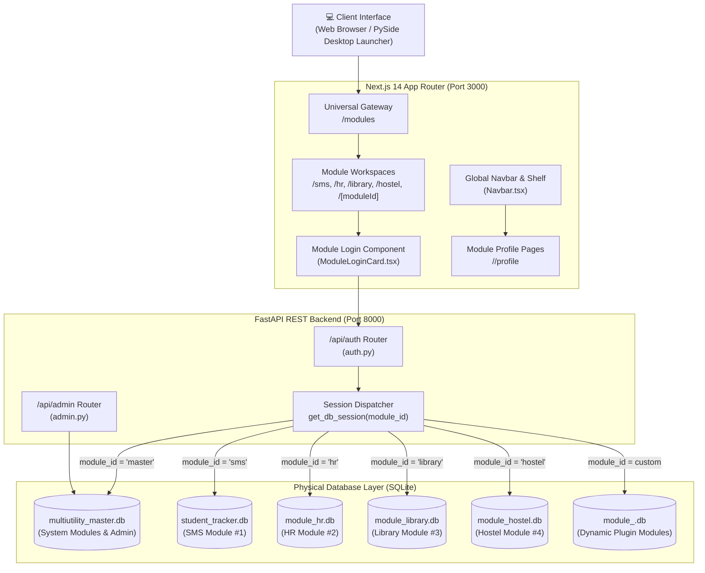
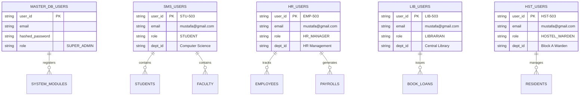
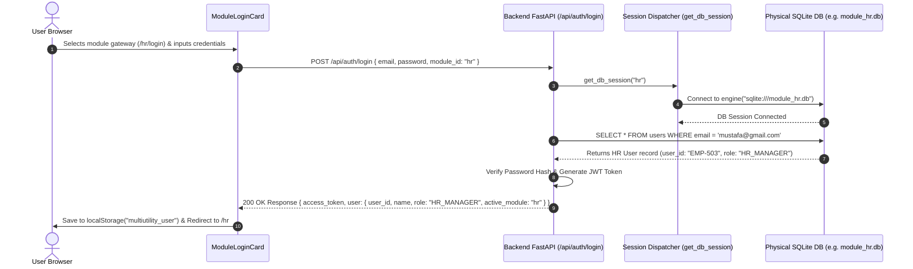
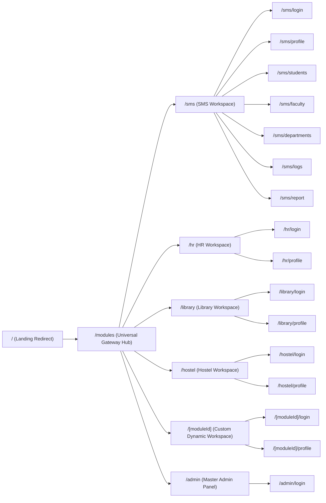
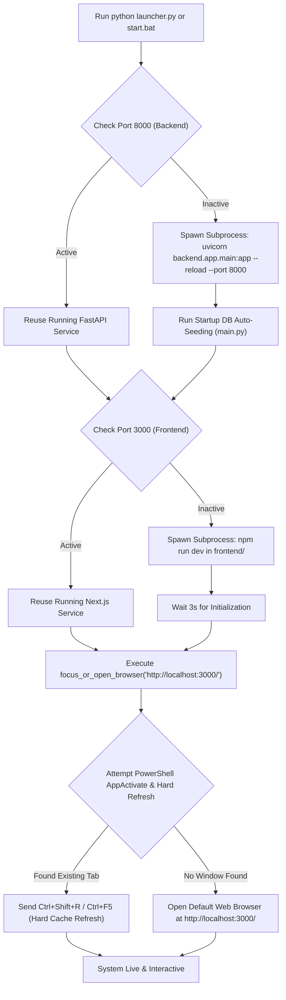

# MultiUtility Tracker — System Dataflow & Database Architecture Diagrams (`dataflow-diagram.md`)

This document provides visual diagrams and architectural flowcharts illustrating the database design, API routing resolution, authentication security lifecycle, client-side session management, and system execution flow of **MultiUtility Tracker**.

---

## 1. High-Level Architecture Overview



---

## 2. Multi-Database Isolation & Schema Entity Flow

Each module accesses its own physical SQLite database to ensure total data segregation.



---

## 3. Authentication & Target DB Routing Sequence

Sequence flow showing how a user logging into a gateway (e.g., HR) gets routed to the exact database file without colliding with other modules.



---

## 4. Client-Side Session Lifecycle & Navbar Resolution

Flowchart detailing local session management, active workspace detection, and profile link calculation.

```mermaid
flowchart TD
    Start["User Opens Page"] --> PathCheck{"Check Pathname"}
    
    PathCheck -->|"/admin/*"| HideNavbar["Suppress Standard Navbar"]
    PathCheck -->|"/modules" or "/"| GatewayState["Render Universal Gateway Hub"]
    PathCheck -->|"/<moduleId>/*"| ModuleState["Resolve Active Module ID (e.g., hr, library, hostel, sms)"]
    
    ModuleState --> UserCheck{"Check localStorage"}
    UserCheck -->|master_admin_session exists| AdminOverride["Set Current User = Master Admin (SUPER_ADMIN)"]
    UserCheck -->|multiutility_user exists| ModuleUser["Set Current User = Module User (e.g., HR_MANAGER)"]
    UserCheck -->|None exists| GuestUser["Show Unauthenticated Gateway State"]
    
    ModuleUser --> NavRender["Render Dynamic Navbar (Navbar.tsx)"]
    NavRender --> ProfileCalc["Calculate Profile Link: currentMod.id != 'gateway' ? /<moduleId>/profile : /sms/profile"]
    
    ProfileCalc --> ClickProfile{"User Clicks 'My Account Profile'"}
    ClickProfile --> ProfileNav["Navigate to /<currentModule>/profile"]
    
    NavRender --> ClickLogout{"User Clicks 'Logout Session'"}
    ClickLogout --> PurgeSession["Purge multiutility_user, multiutility_token, master_admin_session"]
    PurgeSession --> RedirectGateway["Redirect Window to /modules"]
```

---

## 5. Page Sitemap & Component Navigation Hierarchy



---

## 6. One-Click System Launcher Execution Flow (`launcher.py`)



---

*Keep this dataflow document synced with any architectural modifications or new diagram requirements.*
